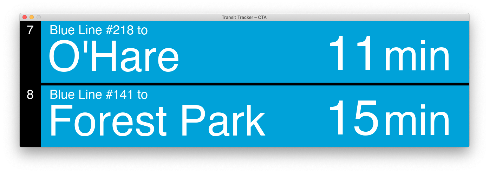

# TransitTracker

Shell and GUI utilities to display train and bus arrival times along the CTA system. Data provided by CTA Train/Bus Tracker.

## Shell utilities

### Train Tracker

`shell/train_arrival_times.py` allows you to display arrival times for a train station on the command line.

Usage: `python shell/train_arrival_times.py <station_code>`

A complete list of station codes is available in the 
[CTA Train Tracker API online documentation](https://www.transitchicago.com/assets/1/6/cta_Train_Tracker_API_Developer_Guide_and_Documentation.pdf).

### Bus Tracker

`shell.bus_arrival_times.py` allows you to display arrival times for a single route and multiple stops along it on the command line.

The primary reason to supply more than one stop code would be to see bus arrivals in both directions at a single location, as bus stops across the street from each other
have different stop codes.

Usage: `python shell/bus_arrival_times.py <route> <stop_code> <stop_code> ...`

A complete list of bus stop codes is available [by searching for the desired line and checking the Bus Stop List](https://www.transitchicago.com/schedules/).

## GUI

The GUI is powered by [pygame](https://www.pygame.org/news). Edit the globals in `gui/utils`, then run the GUI with `python gui/main.py`.

TODO: Add airplane icons for O'Hare- and Midway-bound trains.
